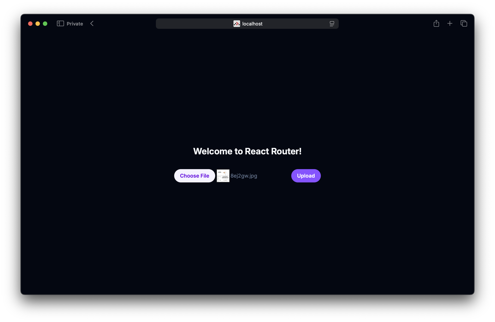

We are going to create a React Router v7 app in _Framework mode_, add an S3 Bucket for file uploads, and deploy it to using the `React` component.

:::tip[View source]
You can [view the source](https://github.com/sst/sst/tree/dev/examples/aws-react-router) of this example in our repo.
:::

Before you get started, make sure to [configure your AWS credentials](/docs/iam-credentials#credentials).

---

### 1. Create a project

Let's start by creating our project.

```bash
npx create-react-router@latest aws-react-router
cd aws-react-router
```

We are picking all the default options.

---

##### Init SST

Now let's initialize SST in our app.

```bash
npx sst@latest init
npm install
```

Select the defaults and pick **AWS**. This'll create a `sst.config.ts` file in your project root.

```ts title="sst.config.ts"
async run() {
  new sst.aws.React("MyWeb");
}
```

---

##### Start dev mode

Run the following to start dev mode. This'll start SST and your React Router app.

```bash
npx sst dev
```

Once complete, click on **MyWeb** in the sidebar and open your React Router app in your browser.

---

### 2. Add an S3 Bucket

Let's allow public `access` to our S3 Bucket for file uploads. Update your `sst.config.ts`.

```js title="sst.config.ts"
const bucket = new sst.aws.Bucket("MyBucket", {
  access: "public"
});
```

Add this above the `React` component.

##### Link the bucket

Now, link the bucket to our React Router app.

```js title="sst.config.ts" {2}
new sst.aws.React("MyWeb", {
  link: [bucket],
});
```

---

### 3. Create an upload form

Add the upload form client in `app/routes/home.tsx`. Replace the `Home` component with:

```tsx title="app/routes/home.tsx"
export default function Home({
  loaderData,
}: Route.ComponentProps) {
  const { url } = loaderData;
  return (
    <div className="flex h-screen items-center justify-center">
      <div className="flex flex-col items-center gap-8">
        <h1 className="leading text-2xl font-bold text-gray-800 dark:text-gray-100">
          Welcome to React Router!
        </h1>
        <form
          className="flex flex-row gap-4"
          onSubmit={async (e) => {
            e.preventDefault();

            const file = (e.target as HTMLFormElement).file.files?.[0]!;

            const image = await fetch(url, {
              body: file,
              method: "PUT",
              headers: {
                "Content-Type": file.type,
                "Content-Disposition": `attachment; filename="${file.name}"`,
              },
            });

            window.location.href = image.url.split("?")[0];
          }}
        >
          <input
            name="file"
            type="file"
            accept="image/png, image/jpeg"
            className="block w-full text-sm text-slate-500
              file:mr-4 file:py-2 file:px-4
              file:rounded-full file:border-0
              file:text-sm file:font-semibold
              file:bg-violet-50 file:text-violet-700
              hover:file:bg-violet-100" />
          <button className="bg-violet-500 hover:bg-violet-700 text-white text-sm
            font-semibold py-2 px-4 rounded-full">
            Upload
          </button>
        </form>
      </div>
    </div>
  );
}
```

---

### 4. Generate a pre-signed URL

When our app loads, we'll generate a pre-signed URL for the file upload and use it in the form.

Add this above the `Home` component in `app/routes/home.tsx`.

```tsx title="app/routes/home.tsx" {4}
export async function loader() {
  const command = new PutObjectCommand({
    Key: crypto.randomUUID(),
    Bucket: Resource.MyBucket.name,
  });
  const url = await getSignedUrl(new S3Client({}), command);

  return { url };
}
```

:::tip
We are directly accessing our S3 bucket with `Resource.MyBucket.name`.
:::

Add the relevant imports.

```tsx title="app/routes/_index.tsx"
import { Resource } from "sst";
import { getSignedUrl } from "@aws-sdk/s3-request-presigner";
import { S3Client, PutObjectCommand } from "@aws-sdk/client-s3";
```

And install the npm packages.

```bash
npm install @aws-sdk/client-s3 @aws-sdk/s3-request-presigner
```

Head over to the local React Router app in your browser, `http://localhost:5173` and try **uploading an image**. You should see it upload and then download the image.



---

### 5. Deploy your app

Now let's deploy your app to AWS.

```bash
npx sst deploy --stage production
```

You can use any stage name here but it's good to create a new stage for production.

Congrats! Your site should now be live!

---

## Connect the console

As a next step, you can setup the [SST Console](/docs/console/) to _**git push to deploy**_ your app and view logs from it.


You can [create a free account](https://console.sst.dev) and connect it to your AWS account.
