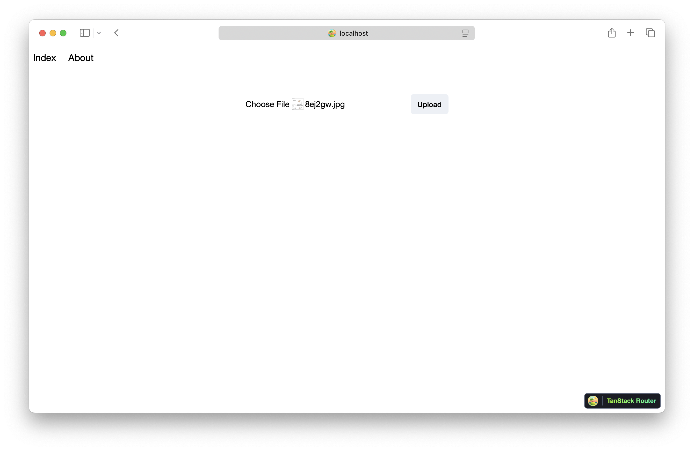

We are going to create a TanStack Start app, add an S3 Bucket for file uploads, and deploy it using the `TanStackStart` component.

:::tip[View source]
You can [view the source](https://github.com/sst/sst/tree/dev/examples/aws-tanstack-start) of this example in our repo.
:::

Before you get started, make sure to [configure your AWS credentials](/docs/iam-credentials#credentials).

---

### 1. Create a project

Let's start by creating our app.

```bash
npx gitpick TanStack/router/tree/main/examples/react/start-bare aws-tanstack-start
cd aws-tanstack-start
```

We are using a bare TanStack example template.

---

##### Init SST

Now let's initialize SST in our app.

```bash
npx sst@latest init
npm install
```

Select the defaults and pick **AWS**. This'll create a `sst.config.ts` file in your project root.

It'll also ask you to update your `app.config.ts` with something like this.

```ts title="app.config.ts"
export default defineConfig({
  server: {
    preset: "aws-lambda",
    awsLambda: {
      streaming: true
    }
  }
});
```

---

##### Start dev mode

Run the following to start dev mode. This'll start SST and your TanStack Start app.

```bash
npx sst dev
```

Once complete, click on **MyWeb** in the sidebar and open your TanStack Start app in your browser.

---

### 2. Add an S3 Bucket

Let's allow public `access` to our S3 Bucket for file uploads. Update your `sst.config.ts`.

```ts title="sst.config.ts"
const bucket = new sst.aws.Bucket("MyBucket", {
  access: "public"
});
```

Add this above the `TanStackStart` component.

##### Link the bucket

Now, link the bucket to our TanStack Start app.

```js title="sst.config.ts" {2}
new sst.aws.TanStackStart("MyWeb", {
  link: [bucket]
});
```

---

### 3. Create an upload form

Add a form component in `src/components/Form.tsx`.

```tsx title="src/components/Form.tsx"
import './Form.css'

export default function Form({ url }: { url: string }) {
  return (
    <form
      className='form'
      onSubmit={async (e) => {
        e.preventDefault()

        const file = (e.target as HTMLFormElement).file.files?.[0] ?? null

        const image = await fetch(url, {
          body: file,
          method: 'PUT',
          headers: {
            'Content-Type': file.type,
            'Content-Disposition': `attachment filename='${file.name}'`,
          },
        })

        window.location.href = image.url.split('?')[0]
      }}
    >
      <input name='file' type='file' accept='image/png, image/jpeg' />
      <button type='submit'>Upload</button>
    </form>
  )
}
```

Add some styles.

```css title="src/components/Form.css"
.form {
  padding: 2rem;
}

.form input {
  margin-right: 1rem;
}

.form button {
  appearance: none;
  padding: 0.5rem 0.75rem;
  font-weight: 500;
  font-size: 0.875rem;
  border-radius: 0.375rem;
  border: 1px solid rgba(68, 107, 158, 0);
  background-color: rgba(68, 107, 158, 0.1);
}

.form button:active:enabled {
  background-color: rgba(68, 107, 158, 0.2);
}
```

---

### 4. Generate a pre-signed URL

When our route loads, we'll generate a pre-signed URL for S3 and our form will upload to it. Add a server function and a route loader in `src/routes/index.tsx`.

```ts title="src/routes/index.tsx" {4}
export const getPresignedUrl = createServerFn().handler(async () => {
  const command = new PutObjectCommand({
    Key: crypto.randomUUID(),
    Bucket: Resource.MyBucket.name
  })
  return await getSignedUrl(new S3Client({}), command)
})

export const Route = createFileRoute('/')({
  component: RouteComponent,
  loader: async () => {
    return { url: await getPresignedUrl() }
  }
})

function RouteComponent() {
  const { url } = Route.useLoaderData()
  return (
    <main>
      <Form url={url} />
    </main>
  )
}
```

:::tip
We are directly accessing our S3 bucket with `Resource.MyBucket.name`.
:::

Add the relevant imports.

```ts title="src/routes/+page.server.ts"
import { Resource } from 'sst'
import Form from '~/components/Form'
import { createServerFn } from '@tanstack/react-start'
import { createFileRoute } from '@tanstack/react-router'
import { getSignedUrl } from '@aws-sdk/s3-request-presigner'
import { S3Client, PutObjectCommand } from '@aws-sdk/client-s3'
```

And install the npm packages.

```bash
npm install @aws-sdk/client-s3 @aws-sdk/s3-request-presigner
```

Head over to the local TanStack Start app in your browser, `http://localhost:3000` and try **uploading an image**. You should see it upload and then download the image.



---

### 5. Deploy your app

Now let's deploy your app to AWS.

```bash
npx sst deploy --stage production
```

You can use any stage name here but it's good to create a new stage for production.

Congrats! Your app should now be live!

---

## Connect the console

As a next step, you can setup the [SST Console](/docs/console/) to _**git push to deploy**_ your app and view logs from it.


You can [create a free account](https://console.sst.dev) and connect it to your AWS account.
